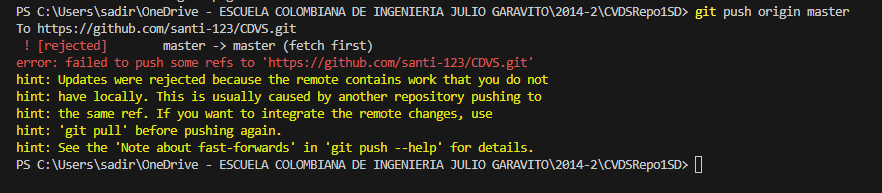
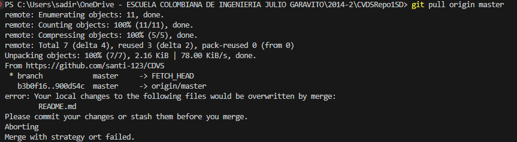
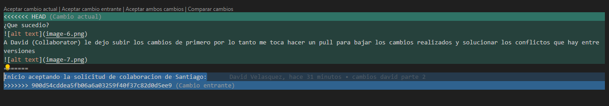
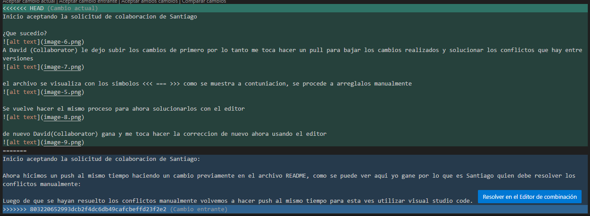
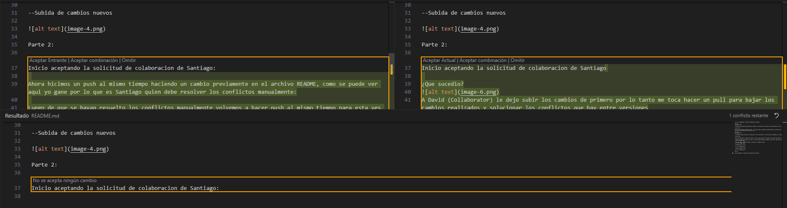
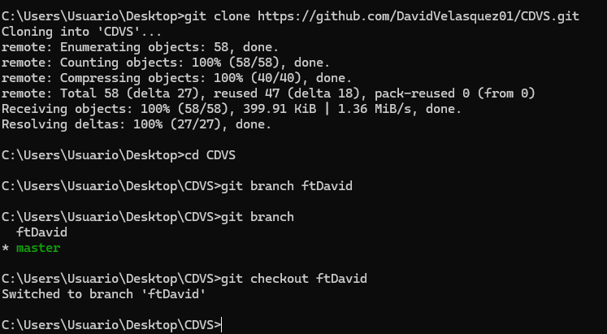

 --Creacion de repositorio localmete

git add
¿Para que sirve?

El comando git add añade una modificación presente en el directorio de trabajo al area de preparacion. Es la forma de decirle a Git qué cambios particulares se realizarán en la próxima confirmación.

¿Como se usa?

Se utiliza ejecutando el comando "git add . (para subir todos los cambios encontardos dentro del directorio de trbabajo o se puede utilizar comandos internos de git si se requiere, para subir cambios de un directiorio de en especifico, particular, etc.)"

git commit
¿Para que sirve?

El comando git commit captura una instancia que se esta realizando en los archivos que se agregaron con el comando git add

¿Como se usa?

Se utiliza ejecutando el comando "git commit -m (este ultimo para dejar un mensaje de los cambios realizados o se puede utilizar otros comandos internos de git si se requieren)"

--Comando git add y git commit para tener los ultimos cambios generados localmente y subirlos al repositorio remoto

--Conexxion con el repositorio remoto, y subida de los cambios al mismo

--Configuracion de correo

--Subida de cambios nuevos

Parte 2:

Inicio aceptando la solicitud de colaboracion de Santiago
Ahora hicimos un push al mismo tiempo haciendo un cambio previamente en el archivo README, como se puede ver aqui yo gane por lo que es Santiago quien debe resolver los conflictos manualmente:

¿Que sucedio?

A David (Collaborator) le dejo subir los cambios de primero por lo tanto me toca hacer un pull para bajar los cambios realizados y solucionar los conflictos que hay entre versiones

el archivo se visualiza con los simbolos <<< === >>> como se muestra a contuniacion, se procede a arreglalos manualmente

Luego de que se hayan resuelto los conflictos manualmente volvemos a hacer push al mismo tiempo para esta ves utilizar visual studio code.
Se vuelve hacer el mismo proceso para ahora solucionarlos con el editor

de nuevo David(Collaborator) gana y me toca hacer la correccion ahora usando el editor

Al hacer el pull nos salen los mismo simbolos <<< === >>>, como se muestra a contuniacion, se procede a arreglalos desde Visual Studio Code

Parte 3:

Ya David habiendo realizado este fork, va a clonarlo en el computador, para hacer cambios y posteriormente hacer un pull request.

Primero va a crear la nueva rama dentro de este:

/////////////////////////////////////////////////

Seccion de preguntas David Velasquez:

Parte 1:

3. Git add sirve para decirle a git que archivos queremos incluir en el seguimiento de git sobre el proyecto actual, si se hace git add . se toman todos los archivos actuales pero tambien se puede solo incluir el nombre de un archivo o una carpeta para solo tomar estos en cuenta.

Git commit con el mensaje nos ayuda a guardar los cambios localmente "como tomarle una foto" al codigo en el momento que se hace, con un mensaje para referenciar los cambios hechos, usualmente utilizando una fecha

Parte 2:

¿Que sucedio?

Desde mi punto de vista se realizaron los cambios correctamente, sin embargo para Santiago no fue asi por lo que debemos resolver los conflictos.

Ahora hicimos un push al mismo tiempo haciendo un cambio previamente en el archivo README, como se puede ver yo gane por lo que es Santiago quien debe resolver los conflictos manualmente, esto es especialmente util en equipos grandes ya que no permite la superposicion de elementos que luego pueden dar muchos problemas

Parte 3:

1. Encontramos que una mejor manera de trabajar esto es realizando un fork ya que asi se trabaja una copia del proyecto, esto en proyectos grandes ayuda mucho ya que no se corre peligro de hacer cambios importantes, y cualquiera de estos es posteriormente revisado en un pull request.

2. Un pull request es una solicitud al repositorio original para que se tomen en cuenta los cambios realizados en una copia del proyecto o en una rama alternativa, con ello el administrador decide que cambios se realizan y que cambios no.
