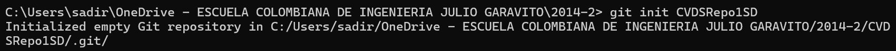
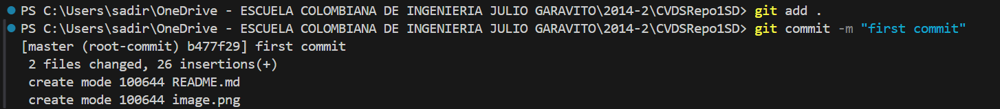
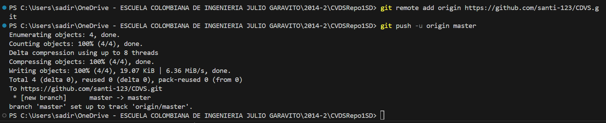
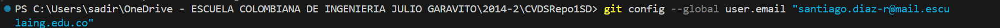
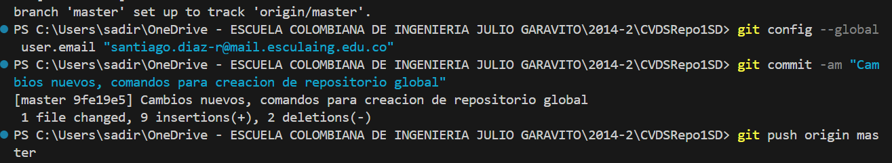

 --Creacion de repositorio localmete

git add
¿Para que sirve?

El comando git add añade una modificación presente en el directorio de trabajo al area de preparacion. Es la forma de decirle a Git qué cambios particulares se realizarán en la próxima confirmación.

¿Como se usa?

Se utiliza ejecutando el comando "git add . (para subir todos los cambios encontardos dentro del directorio de trbabajo o se puede utilizar comandos internos de git si se requiere, para subir cambios de un directiorio de en especifico, particular, etc.)"

git commit
¿Para que sirve?

El comando git commit captura una instancia que se esta realizando en los archivos que se agregaron con el comando git add

¿Como se usa?

Se utiliza ejecutando el comando "git commit -m (este ultimo para dejar un mensaje de los cambios realizados o se puede utilizar otros comandos internos de git si se requieren)"

--Comando git add y git commit para tener los ultimos cambios generados localmente y subirlos al repositorio remoto

--Conexxion con el repositorio remoto, y subida de los cambios al mismo

--Configuracion de correo

--Subida de cambios nuevos

Parte 2:

Inicio aceptando la solicitud de colaboracion de Santiago:
