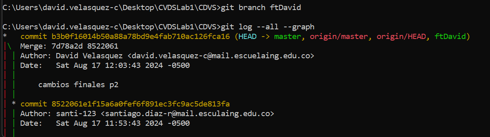

INTEGRANTES:
David Felipe Velasquez Contreras (Collaborator)
Santiago Diaz Rojas (Owner)

PASO A PASO:

Parte 1:

Creacion de repositorio localmete

 

Comando git add y git commit para tener los ultimos cambios generados localmente y subirlos al repositorio remoto

Conexxion con el repositorio remoto, y subida de los cambios al mismo

Configuracion de correo

Subida de cambios nuevos

Parte 2:

Inicio aceptando la solicitud de colaboracion de Santiago
Ahora hicimos un push al mismo tiempo haciendo un cambio previamente en el archivo README, como se puede ver aqui yo gane por lo que es Santiago quien debe resolver los conflictos manualmente:

A David (Collaborator) le dejo subir los cambios de primero por lo tanto me toca hacer un pull para bajar los cambios realizados y solucionar los conflictos que hay entre versiones

el archivo se visualiza con los simbolos <<< === >>> como se muestra a contuniacion, se procede a arreglalos manualmente

Luego de que se hayan resuelto los conflictos manualmente volvemos a hacer push al mismo tiempo para esta ves utilizar visual studio code.
Se vuelve hacer el mismo proceso para ahora solucionarlos con el editor

de nuevo David(Collaborator) gana y me toca hacer la correccion ahora usando el editor

Al hacer el pull nos salen los mismo simbolos <<< === >>>, como se muestra a contuniacion, se procede a arreglalos desde Visual Studio Code

Parte 3:
Se procede hacer la creacion de la rama "features/santiago" para poder hacer un pull request de mis cambios con los de David

PREGUNTAS: 
--Santiago Diaz Rojas

Parte 1:
git add
¿Para que sirve?
El comando git add añade una modificación presente en el directorio de trabajo al area de preparacion. Es la forma de decirle a Git qué cambios particulares se realizarán en la próxima confirmación.

¿Como se usa?
Se utiliza ejecutando el comando "git add . (para subir todos los cambios encontardos dentro del directorio de trbabajo o se puede utilizar comandos internos de git si se requiere, para subir cambios de un directiorio de en especifico, particular, etc.)"

git commit
¿Para que sirve?
El comando git commit captura una instancia que se esta realizando en los archivos que se agregaron con el comando git add

¿Como se usa?
Se utiliza ejecutando el comando "git commit -m (este ultimo para dejar un mensaje de los cambios realizados o se puede utilizar otros comandos internos de git si se requieren)"

Parte 2: 
¿Que sucedio?
Como se inteta hacer una modificacion del repositorio remoto en donde la version del repositorio local no es la misma, este bloquea el push, con el fin de no permitir la 
la modificacion de una version correcta dentro del repositorio remoto. Por eso nos toca actualizar el repositorio local con un pull y solucionar los problemas de los archivos ya sea manualmente o con ayuda de algun IDE.

Parte 3:

¿Hay una mejor forma de trabajar con Git para no tener conflictos?
Sí, hay varias maneras de trabajar con Git para minimizar los conflictos, especialmente cuando varias personas trabajan en la misma rama, como master.

Crear una rama de trabajo: En lugar de trabajar directamente en la rama master, siempre crear una propia rama. Esto aísla cambios y evita que interfieran con los de otros hasta que estés listo para integrarlos.

Hacer pulls frecuentemente: Antes de empezar a trabajar, hay que asegurarce de hacer un pull de la última versión de master para que la rama esté actualizada. Esto reduce la probabilidad de conflictos más adelante.

¿Qué es y como funciona el Pull Request?
Un Pull Request (PR) es una herramienta que permite proponer cambios en la rama master de un proyecto, pero de una manera que otros puedan revisar antes de integrarlos. 
para que funcione corectamente se debe hacer los siguientes pasos:

1. Crea una rama

2. Trabaja en la rama

3. Actualiza tu rama

4. Envía un PR

6. Resuelve conflictos(Si Git detecta conflictos al intentar fusionar el PR, habra que resolverlos manualmente. El proceso es sencillo: Git indicará los archivos en conflicto, y se determina cómo combinar los cambios.)

7. Merge en master: Una vez que el PR sea aprobado y los conflictos se hayan resuelto, los cambios se pueden fusionar en master, manteniendo el código estable y sin conflictos.